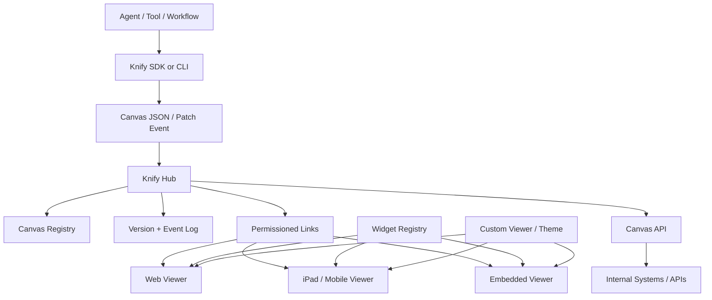

The agent does not own the UI. The agent emits a canvas contract. Viewers render it. Hubs persist it. Links distribute it.



## System hierarchy

```text
Knify Protocol
  Canvas Schema
    Blocks
    Data
    Layout
    Events
    Actions
    Provenance
    Exports/API contract

Knify Hub
  Canvas registry
  Version history
  Patch/event stream
  Link permissions
  Forking
  API access

Knify Viewers
  Web viewer
  Embedded viewer
  iPad/mobile app
  Custom branded viewers
```

## Sequence

```mermaid
sequenceDiagram
    participant Agent
    participant SDK
    participant Hub
    participant Link
    participant Viewer
    participant APIConsumer

    Agent->>SDK: create canvas object
    SDK->>Hub: POST /canvases
    Hub-->>SDK: canvas_id + links

    SDK-->>Agent: view_link + update_token

    Viewer->>Link: open knify.link/c/abc123
    Link->>Hub: resolve link + permission
    Hub-->>Viewer: canvas snapshot

    Agent->>Hub: PATCH /canvases/canv_123
    Hub-->>Viewer: live update event

    APIConsumer->>Hub: GET /canvases/canv_123/exports/misfire_count
    Hub-->>APIConsumer: 317
```
